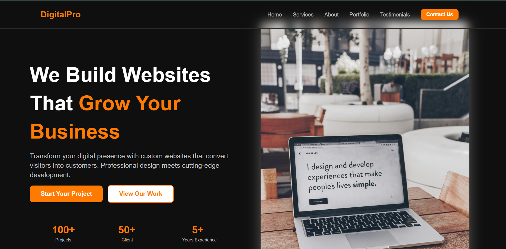

# DigitalPro - Digital Agency Website

A modern, fully responsive digital agency landing page built with HTML, CSS, and JavaScript.

## Live Demo

[View Live](https://musawir-ali.github.io/DigitalPro---Agency-Website/)

## Preview



## Features

- Fully responsive design (mobile, tablet, desktop)
- Sticky navbar with blur effect
- Mobile hamburger menu with slide-in animation
- Smooth scroll navigation
- Interactive service cards with hover effects
- Portfolio grid with image overlay and view button
- Testimonials section
- Custom dropdown selector (JavaScript)
- Contact form with focus effects
- Animated portfolio card tap effect on mobile

## Sections

- **Hero** — Headline, description, CTA buttons, and stats
- **Services** — 4 service cards with icons and hover effects
- **About** — Agency info, team image, and stat cards
- **Portfolio** — 6 project cards in a 3-column grid
- **Testimonials** — 3 client review cards
- **Contact** — Contact form with custom dropdown
- **Footer** — Brand info, quick links, services, contact info

## Built With

- HTML5
- CSS3 (Flexbox, Grid, Media Queries)
- JavaScript (Vanilla)
- Font Awesome Icons

## Getting Started

1. Clone the repository
```
git clone https://github.com/your-username/digitalpro.git
```

2. Open `index.html` in your browser

## Folder Structure

```
digitalpro/
├── index.html
├── style.css
└── image/
    ├── 1.jpg
    ├── 2.jfif
    ├── agency.jpg
    ├── restaurant.jpg
    ├── ecommerce.jpg
    ├── gym.jpg
    ├── saas.jpg
    ├── business.jpg
    ├── michael.jfif
    ├── Sarah Williams.jfif
    └── Emily Chen.jfif
```

## Author

Built by Musawir A.
